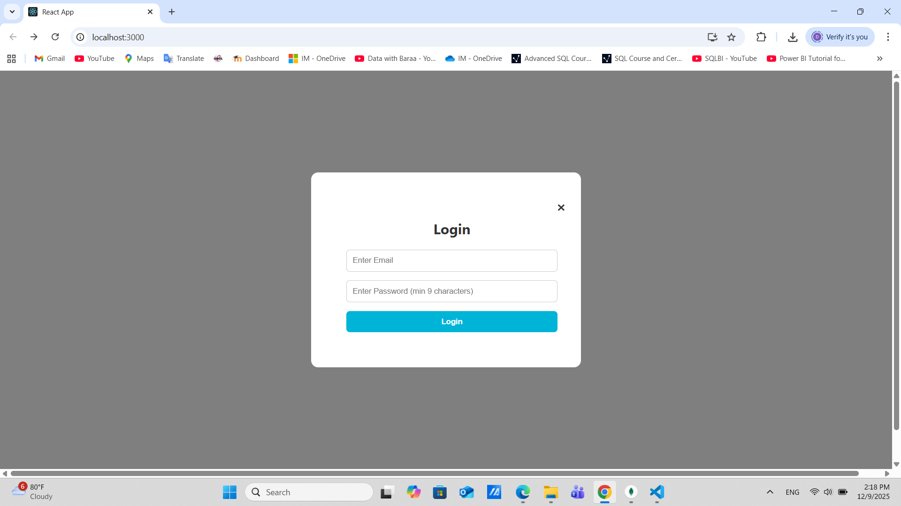
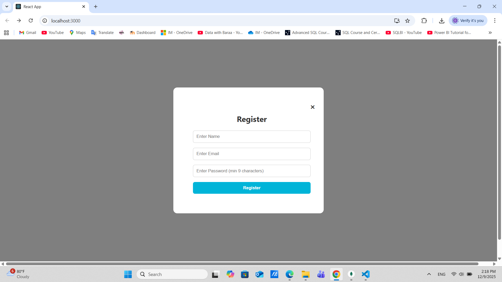
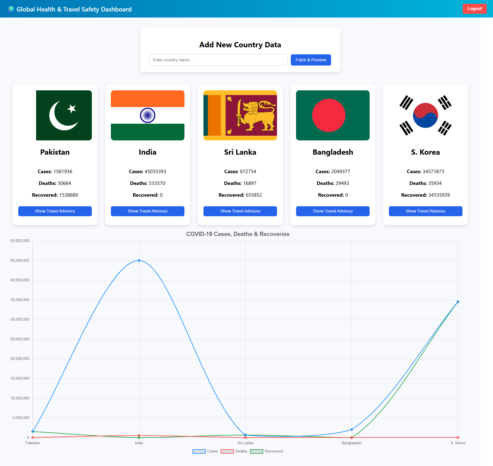
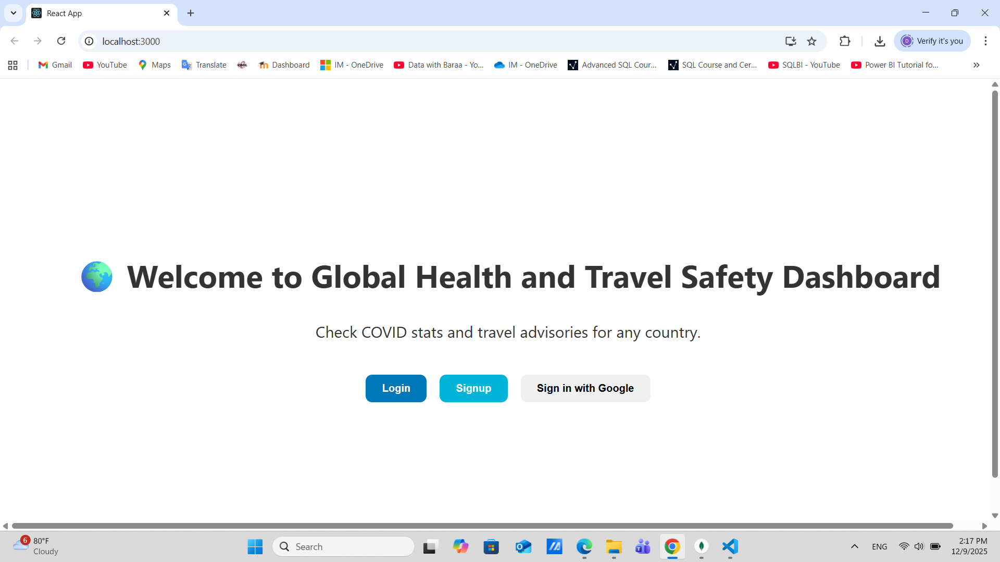

# 🌍 Global Health & Travel Safety Dashboard

## 📌 Introduction

### 1.1 Background
The Global Health and Travel Safety Dashboard is a web-based client-server application designed to help travelers make informed decisions by integrating real-time health and safety data.

The system fetches COVID-19 statistics using the disease.sh API and attempts to integrate travel advisory information. Data is displayed on an interactive dashboard with charts and indicators. User searches are stored in MongoDB for historical analysis.

---
## 📷 Screenshots

### 🔐 Login Page

### 🔐 Sign up Page

### 📊 Dashboard

### 🌍 Home Page

### 1.2 Purpose of the System
This system provides:
- Real-time COVID-19 statistics (cases, deaths, recoveries)
- Travel advisory information (currently limited)
- Data visualization using charts
- Historical data storage

---

### 1.3 Architecture Overview
The application follows a client-server architecture:

- **Frontend:** React.js
- **Backend:** Node.js + Express
- **Database:** MongoDB

**Flow:**
1. User sends request from frontend  
2. Backend fetches data from APIs  
3. Data is processed and stored  
4. Results are displayed on dashboard  

---

## 🎯 Objectives

### General Objective
To develop a user-friendly system that provides real-time global health and travel safety information.

### Specific Objectives
- Aggregate data from multiple APIs  
- Provide real-time updates  
- Build an intuitive UI using React  
- Visualize data using charts  
- Store data in MongoDB  
- Implement authentication (JWT & Google OAuth)  
- Ensure system security  

---

## 🏗️ System Architecture

### Components
- Frontend: React.js  
- Backend: Node.js + Express  
- Database: MongoDB  
- Authentication: JWT + Google OAuth  
- External APIs: COVID-19 API & Travel Advisory API  

---

## 🔌 APIs Used

### COVID-19 API
https://disease.sh/docs/

**Provides:**
- Country  
- Cases  
- Deaths  
- Recoveries  

### Travel Advisory API (Limited)
https://www.travel-advisory.info/api

**Provides:**
- Advisory message  
- Country flag  

> ⚠️ Note: Travel advisory API is unstable and may not return data.

---

## 💻 Client-Side

### Technologies
- React.js  
- Axios  
- Chart.js  
- CSS  

### Features
- Login & Signup  
- Google Authentication  
- Country search  
- Dashboard with data cards  
- Charts  
- Error handling  

---

## ⚙️ Backend

### Technologies
- Node.js  
- Express.js  
- MongoDB  
- Mongoose  
- JWT  

### API Endpoints

- `POST /auth/signup` → Register user  
- `POST /auth/login` → Login user  
- `POST /submit` → Save country data  
- `GET /records` → Get saved records  

---

## 🔐 Security

- JWT Authentication  
- API Key protection  
- Password hashing (bcrypt)  
- Input validation  
- CORS setup  

---

## 🧪 Testing

Tested using Postman:
- Signup  
- Login  
- Data submission  
- Data retrieval  

---

## 📊 Features

- Country search  
- COVID-19 data visualization  
- Save & retrieve records  
- Secure authentication  

---

## ⚠️ Challenges & Limitations

### Challenges
- API failures and inconsistencies  
- JWT & Google OAuth integration  
- Managing React state  
- Data visualization  

### Limitations
- Travel advisory API not reliable  
- Requires internet connection  
- Manual country input  
- Limited dashboard filtering  

---

## 🚀 Future Improvements

- Use reliable travel advisory APIs  
- Add autocomplete for country search  
- Improve UI/UX  
- Add filters and search  
- Make mobile-friendly  

---

## 📽️ Demo & Repository

**Video Demo:**  
https://drive.google.com/file/d/1SVUz_E0pnHeKhTmZFhYsvB1Vz8AapFX4/view  

**GitHub Repository:**  
https://github.com/hasandi22/Mini-Project---Service-Oriented-Computing.git  

---

## 📚 Conclusion

This project demonstrates how to build a full-stack application using React, Node.js, and MongoDB while integrating multiple APIs and implementing authentication.

Despite limitations with travel advisory data, the system provides a centralized platform for monitoring global COVID-19 information.
